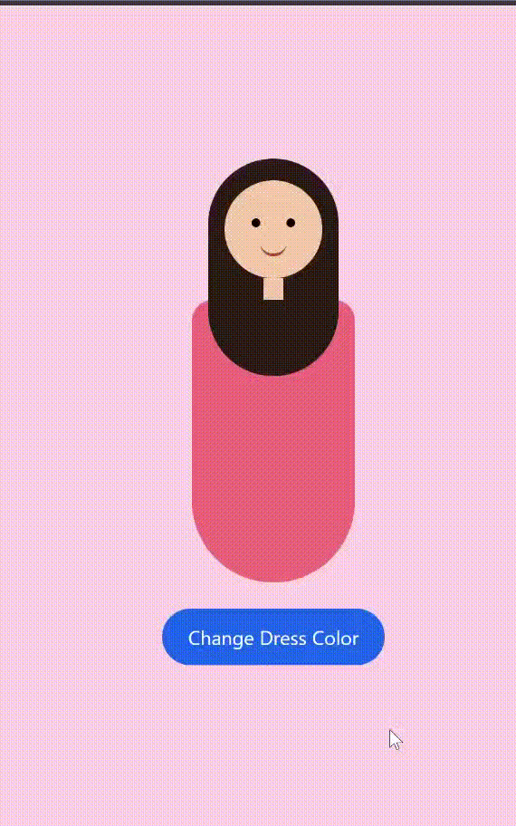

# 🌸👗 Dress-Up Girl 👗🌸
<div align="center">
  
</div>


---

## 🌟 Features

- 👧 Cute interactive girl with **long hair**  
- 👗 Flared **long dress**  
- 🎨 Click to **change dress color randomly**  
- 💻 Built with **HTML, CSS, JavaScript**  
- 🖱️ Fun, interactive, and easy to play with  

---

## 🖌️ How It Works (Mini Code Snippet)

```javascript
let dressColors = ["#e75d7c","#b16cef","#53cca4","#efc84d","#628ef0","#883e7f","#ed048b"];
let dress = document.getElementById("dress");

function changeDressColor() {
  let random = Math.floor(Math.random() * dressColors.length);
  dress.style.backgroundColor = dressColors[random];
}
```

## Click the button and watch her dress change color magically! 🌈✨
🎨 Dress Colors

💖 Pink (#e75d7c)

💜 Purple (#b16cef)

💚 Green (#53cca4)

💛 Yellow (#efc84d)

💙 Blue (#628ef0)

💜 Magenta (#883e7f)

💗 Hot Pink (#ed048b)

---

## 🛠️ Tech Stack


---

🌸 Inspiration

Made for interactive fashion fun and learning simple creative coding.
Great practice for DOM manipulation, CSS design, and JS interactivity! 💖

🎀 How to Run

## Clone the repo:

git clone https://github.com/your-aviatrix999/dress-your-doll.git
Open dress-your-doll.html in your browser
Click the “Change Dress Color” button and enjoy! 🌈

📌 **Author**

**Amisha Patel**
✨ First-year CSE student | Exploring Web Development & JavaScript

---

⭐ If you like this project, don’t forget to star the repository!

